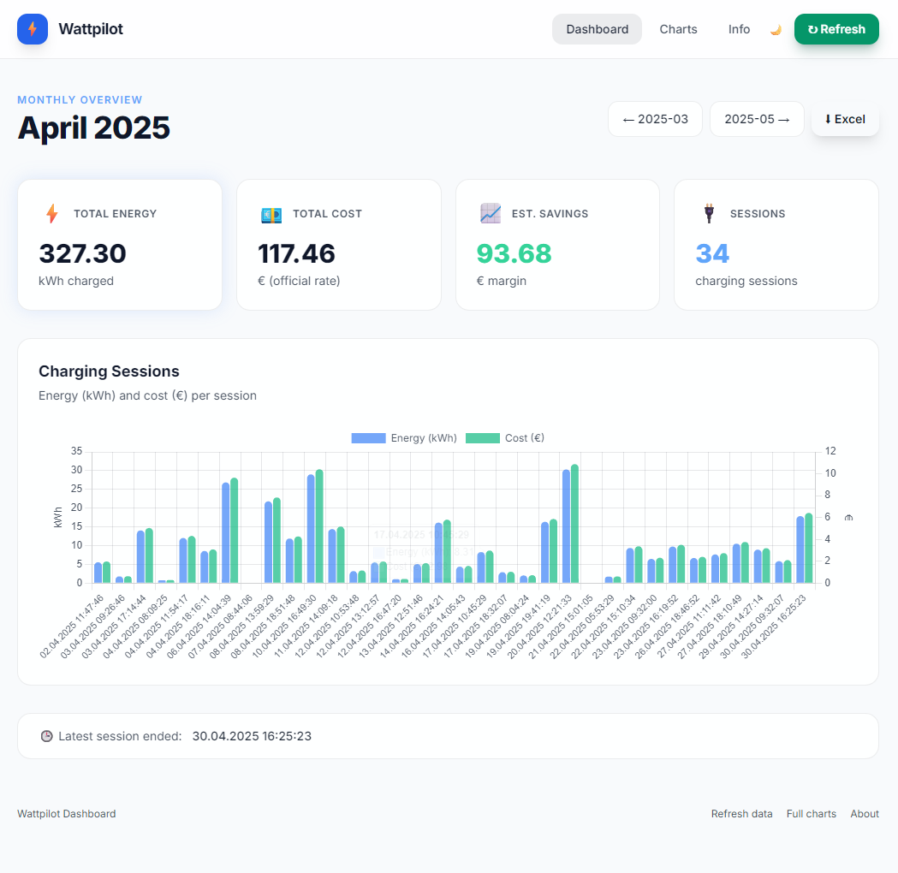

# Wattpilot Data Exporter ⚡

A lightweight Go web application that fetches EV charging session data from [Fronius Wattpilot](https://www.fronius.com/en/solar-energy/installers-partners/products-solutions/e-mobility/wattpilot) and calculates monthly charging costs based on the official Austrian government electricity rates ([BMF Sachbezug](https://www.bmf.gv.at/themen/steuern/arbeitnehmerveranlagung/pendlerfoerderung-das-pendlerpauschale/sachbezug-kraftfahrzeug.html)).

## Features

- **Monthly dashboard** — view charging sessions, total energy (kWh), cost (€), and margin for any month
- **Historical charts** — visualize energy consumption and costs over time (data since June 2024)
- **Excel export** — download a per-month `.xlsx` billing report with detailed session data and cost summary
- **Live charging indicator** — detects whether a charging session is currently active
- **Data caching and backup fallback** — data is cached in local filesystem storage or Azure Blob Storage; monthly backups are stored as `data/*_backup.json`; use the `/refresh` endpoint to re-fetch
- **OpenTelemetry observability** — automatic HTTP request traces, app-level spans, and structured logs
- **Docker support** — multi-stage Docker build for minimal container images



## Prerequisites

- **Go 1.25+** (or Docker)
- A **Wattpilot API key** (`WATTPILOT_KEY`)

## Configuration

| Variable | Required | Description |
|---|---|---|
| `WATTPILOT_KEY` | Yes | Your Wattpilot data export key |
| `OTEL_EXPORTER_OTLP_ENDPOINT` | No | OTLP/HTTP collector endpoint (for example `http://localhost:4318`) |
| `AZURE_STORAGE_ACCOUNT_NAME` | No | Enables Azure Blob Storage backend when set |
| `AZURE_STORAGE_CONTAINER_NAME` | No | Blob container name (defaults to `wattpilot-data`) |

You can find the key on your Wattpilot export page — it is the `e=` query parameter in the URL:

```
https://data.wattpilot.io/export?e=THIS_IS_YOUR_KEY
```

Create a `.env` file in the repository root (see `.env.example`):

```bash
# .env
WATTPILOT_KEY=your_key_here
# Optional: send traces/logs to an OpenTelemetry collector
OTEL_EXPORTER_OTLP_ENDPOINT=http://localhost:4318
```

## Observability (OpenTelemetry)

The app includes built-in **OpenTelemetry tracing and logging**:

- All incoming HTTP requests are instrumented automatically (method, route, status code, duration, propagation headers).
- Core business operations (data fetch, monthly calculations, refresh flow) emit spans.
- `slog` is bridged to OpenTelemetry so structured logs are emitted through the OTel log pipeline.

Exporter behavior:

- If `OTEL_EXPORTER_OTLP_ENDPOINT` is set, traces and logs are sent via **OTLP/HTTP** to your collector.
- If it is not set, telemetry is written to stdout, which is convenient for local development and debugging.

Example local collector setup:

```bash
# .env
WATTPILOT_KEY=your_key_here
OTEL_EXPORTER_OTLP_ENDPOINT=http://localhost:4318
```

## Getting Started

### Run locally

```bash
go run ./cmd/server
```

Or use the Makefile:

```bash
make run        # fetches fresh data (deletes cached data/data.json first)
make run-cached # uses cached data/data.json if available
```

The application starts on **http://localhost:8080**.

### Run with Docker

```bash
make docker-build
make docker-run
```

> Make sure a `.env` file with your `WATTPILOT_KEY` exists in the repository root — it is passed to the container via `--env-file`.

### Deploy to Azure

This project is configured for deployment to **Azure Container Apps** using the **Azure Developer CLI (azd)**.

`WATTPILOT_KEY` is stored in **Azure Key Vault** and consumed by the Container App via a Key Vault secret reference using a **user-assigned managed identity**. The application writes cached data and backups to Azure Blob Storage using a **system-assigned managed identity**.

**Prerequisites:**
- [Azure Developer CLI (`azd`)](https://learn.microsoft.com/en-us/azure/developer/azure-developer-cli/)
- [Azure CLI (`az`)](https://learn.microsoft.com/en-us/cli/azure/)
- An Azure subscription
- Docker Hub account with push credentials

**Quick start:**

```bash
# Login to Azure
azd auth login

# Initialize environment (from repo root)
azd init -e wattpilot-prod

# Configure
azd env set AZURE_LOCATION swedencentral
azd env set WATTPILOT_KEY <your-wattpilot-api-key>
azd env set DOCKER_USERNAME <your-dockerhub-username>
azd env set DOCKER_PASSWORD <your-dockerhub-password>

# Provision infrastructure
azd provision

# Deploy application
azd deploy

# Get the deployed URL
azd env get-values | grep AZURE_CONTAINER_APP_FQDN
```

`azd deploy` automatically builds, tags, and pushes the container image; no manual `CONTAINER_IMAGE` value is required.

See [AZD-SETUP.md](AZD-SETUP.md) for detailed Azure deployment instructions.

### CI/CD (GitHub Actions)

The repository includes a GitHub Actions workflow (`.github/workflows/deploy-container-app.yml`) that automatically deploys to Azure Container Apps on every push to `main`.

**What it does:**
- **On pull requests:** builds the Docker image without pushing (validation only)
- **On push to `main`:** authenticates to Azure via OIDC, logs into Docker Hub, and runs `azd deploy`

**Required repository secrets:**

| Secret | Description |
|---|---|
| `WATTPILOT_AZURE_CLIENT_ID` | Azure AD app registration client ID (with OIDC federation) |
| `WATTPILOT_AZURE_SUBSCRIPTION_ID` | Azure subscription ID |
| `WATTPILOT_AZURE_TENANT_ID` | Azure AD tenant ID |
| `WATTPILOT_REGISTRY_USERNAME` | Docker Hub username |
| `WATTPILOT_REGISTRY_PASSWORD` | Docker Hub access token |

**Azure OIDC setup:**

The workflow uses [workload identity federation](https://learn.microsoft.com/entra/workload-id/workload-identity-federation) (no stored client secrets). The Azure AD app registration must have a federated credential with:
- **Issuer:** `https://token.actions.githubusercontent.com`
- **Subject:** `repo:jetzlstorfer/wattpilot-exporter:ref:refs/heads/main`
- **Audience:** `api://AzureADTokenExchange`

## Routes

| Route | Description |
|---|---|
| `/` | Monthly dashboard (use `?date=YYYY-MM` to navigate) |
| `/charts` | Historical charts across all months |
| `/download` | Download monthly Excel report (`?date=YYYY-MM`) |
| `/info` | Info page |
| `/refresh` | Force re-fetch of data from the Wattpilot API |

## Official Electricity Rates

Charging costs are calculated using the yearly rates published by the Austrian Federal Ministry of Finance:

| Year | Rate (€/kWh) |
|---|---|
| 2024 | 0.33182 |
| 2025 | 0.35889 |
| 2026 | 0.32806 |

## Tech Stack

- [Go](https://go.dev/) — HTTP server & business logic
- [Chart.js](https://www.chartjs.org/) — client-side charting
- [Tailwind CSS](https://tailwindcss.com/) — styling
- [excelize](https://github.com/qax-os/excelize) — Excel file generation
- [godotenv](https://github.com/joho/godotenv) — `.env` file loading
- [OpenTelemetry](https://opentelemetry.io/) — distributed traces and structured logs

## Project Structure

```
wattpilot-exporter/
├── cmd/
│   └── server/
│       ├── main.go          # HTTP server, routes & signal handling
│       └── telemetry.go     # OpenTelemetry initialisation
├── internal/
│   ├── handlers/
│   │   ├── dashboard.go     # / handler — monthly dashboard
│   │   ├── charts.go        # /charts handler — historical month-over-month stats
│   │   └── download.go      # /download handler — Excel export
│   └── wattpilot/
│       ├── storage.go       # local filesystem / Azure Blob storage abstraction
│       └── wattpilot.go     # API client, refresh logic, pricing, parsing & backup handling
├── templates/               # HTML templates (dashboard, charts, info)
├── static/                  # Client-side assets (Chart.js, Tailwind CSS, icons, PWA manifest)
├── data/                    # Runtime cache — data.json and monthly *_backup.json files
├── infra/                   # Azure Bicep IaC
├── Dockerfile               # Multi-stage Alpine build
├── Makefile                 # Build, run & Docker targets
├── azure.yaml               # Azure Developer CLI configuration
└── go.mod
```

## Makefile Targets

| Target | Description |
|---|---|
| `make build` | Compile the binary |
| `make run` | Delete cached data and run the app |
| `make run-cached` | Run the app using cached data |
| `make clean` | Remove binary and cached data |
| `make docker-build` | Build the Docker image |
| `make docker-run` | Run the Docker container |

## License

This project is provided as-is for personal use.

## Resources

- [BMF Sachbezug Kraftfahrzeug](https://www.bmf.gv.at/themen/steuern/arbeitnehmerinnenveranlagung/pendlerfoerderung-das-pendlerpauschale/sachbezug-kraftfahrzeug.html) — official electricity price reference
- [Wattpilot Data Export](https://data.wattpilot.io/) — Fronius Wattpilot data API
