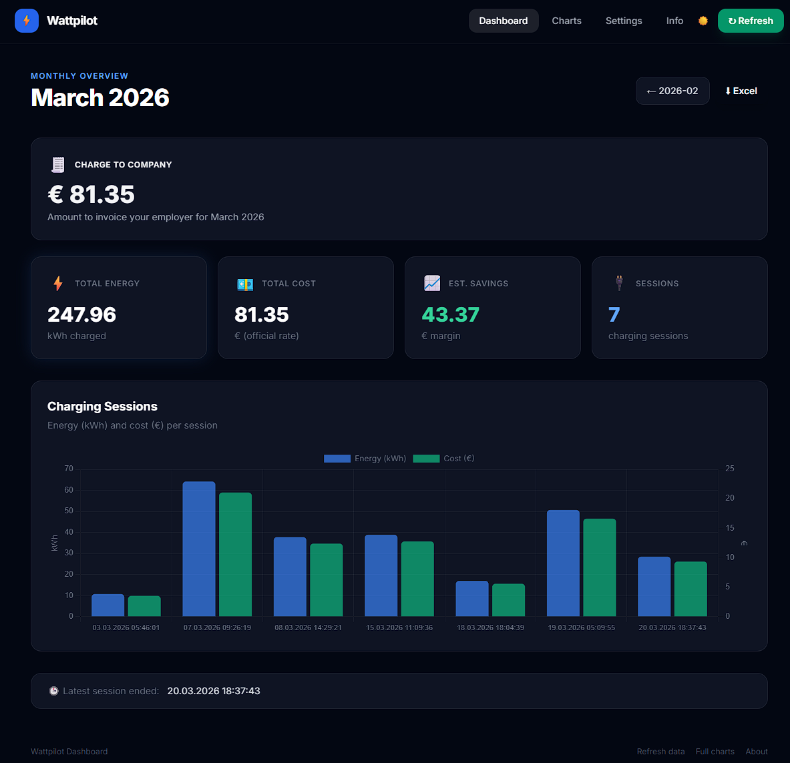
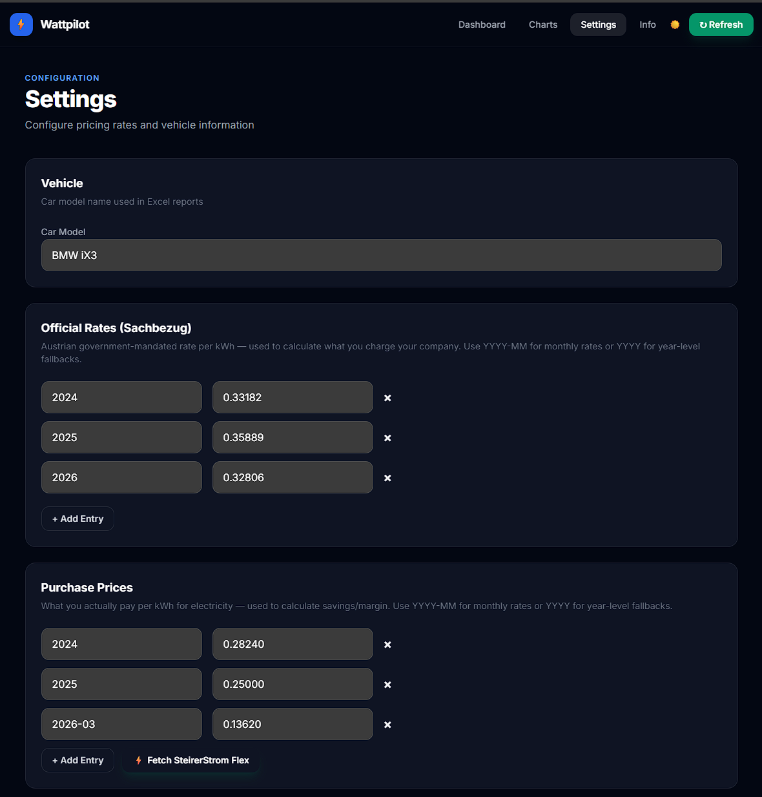

# Wattpilot Data Exporter ⚡

A lightweight Go web application that fetches EV charging session data from [Fronius Wattpilot](https://www.fronius.com/en/solar-energy/installers-partners/products-solutions/e-mobility/wattpilot) and calculates monthly charging costs based on the official Austrian government electricity rates ([BMF Sachbezug](https://www.bmf.gv.at/themen/steuern/arbeitnehmerveranlagung/pendlerfoerderung-das-pendlerpauschale/sachbezug-kraftfahrzeug.html)).


## Features

- **Monthly dashboard** — view charging sessions, total energy (kWh), cost (€), and margin for any month
- **Charge to Company** — prominent display of the amount to invoice your employer (official Sachbezug rate × energy)
- **Historical charts** — visualize energy consumption and costs over time (data since June 2024)
- **Excel export** — download a per-month `.xlsx` billing report with detailed session data, cost summary, and charge-to-company amount
- **Configurable settings** — in-app settings page to manage car model, official rates, purchase prices (per month), and network fees — persisted in Azure Blob Storage
- **SteirerStrom Flex price fetch** — one-click fetch of the current electricity price from [tarife.at](https://www.tarife.at/energie/anbieter/energie-steiermark/steirerstrom-flex-391)
- **Entra ID authentication** — Azure Easy Auth restricts access to your Azure AD tenant
- **Custom domain support** — CNAME + managed TLS certificate configured in Bicep
- **Live charging indicator** — dashboard status banner on the current month view that appears when charging seems active based on recent session updates
- **Data caching and backup fallback** — data is cached in local filesystem storage or Azure Blob Storage; monthly backups are stored as `data/*_backup.json`; use the `/refresh` endpoint to re-fetch
- **OpenTelemetry observability** — automatic HTTP request traces, app-level spans, and structured logs
- **Docker support** — multi-stage Docker build for minimal container images





## Prerequisites

- **Go 1.25+** (or Docker)
- A **Wattpilot API key** (`WATTPILOT_KEY`)

## Configuration

| Variable | Required | Description |
|---|---|---|
| `WATTPILOT_KEY` | Yes | Your Wattpilot data export key |
| `OTEL_EXPORTER_OTLP_ENDPOINT` | No | OTLP/HTTP collector endpoint (for example `http://localhost:4318`) |
| `AZURE_STORAGE_ACCOUNT_NAME` | No | Enables Azure Blob Storage backend when set |
| `AZURE_STORAGE_CONTAINER_NAME` | No | Blob container name (defaults to `wattpilot-data`) |
| `AZURE_STORAGE_ENDPOINT` | No | Azure Blob Storage endpoint for settings persistence (set automatically by Bicep) |

You can find the key on your Wattpilot export page — it is the `e=` query parameter in the URL:

```
https://data.wattpilot.io/export?e=THIS_IS_YOUR_KEY
```

Create a `.env` file in the repository root (see `.env.example`):

```bash
# .env
WATTPILOT_KEY=your_key_here
# Optional: send traces/logs to an OpenTelemetry collector
OTEL_EXPORTER_OTLP_ENDPOINT=http://localhost:4318
```

## Observability (OpenTelemetry)

The app includes built-in **OpenTelemetry tracing and logging**:

- All incoming HTTP requests are instrumented automatically (method, route, status code, duration, propagation headers).
- Core business operations (data fetch, monthly calculations, refresh flow) emit spans.
- `slog` is bridged to OpenTelemetry so structured logs are emitted through the OTel log pipeline.

Exporter behavior:

- If `OTEL_EXPORTER_OTLP_ENDPOINT` is set, traces and logs are sent via **OTLP/HTTP** to your collector.
- If it is not set, telemetry is written to stdout, which is convenient for local development and debugging.

Example local collector setup:

```bash
# .env
WATTPILOT_KEY=your_key_here
OTEL_EXPORTER_OTLP_ENDPOINT=http://localhost:4318
```


## Getting Started

### Run locally

```bash
go run ./cmd/server
```

Or use the Makefile:

```bash
make run        # fetches fresh data (deletes cached data/data.json first)
make run-cached # uses cached data/data.json if available
```

The application starts on **http://localhost:8080**.

### Run with Docker

```bash
make docker-build
make docker-run
```

> Make sure a `.env` file with your `WATTPILOT_KEY` exists in the repository root — it is passed to the container via `--env-file`.

### Deploy to Azure

This project is configured for deployment to **Azure Container Apps** using the **Azure Developer CLI (azd)**.

`WATTPILOT_KEY` is stored in **Azure Key Vault** and consumed by the Container App via a Key Vault secret reference using a **user-assigned managed identity**. The application writes cached data and backups to Azure Blob Storage using a **system-assigned managed identity**.

**Prerequisites:**
- [Azure Developer CLI (`azd`)](https://learn.microsoft.com/en-us/azure/developer/azure-developer-cli/)
- [Azure CLI (`az`)](https://learn.microsoft.com/en-us/cli/azure/)
- An Azure subscription
- Docker Hub account with push credentials

**Quick start:**

```bash
# Login to Azure
azd auth login

# Initialize environment (from repo root)
azd init -e wattpilot-prod

# Configure core settings
azd env set AZURE_LOCATION swedencentral
azd env set WATTPILOT_KEY <your-wattpilot-api-key>
azd env set DOCKER_USERNAME <your-dockerhub-username>
azd env set DOCKER_PASSWORD <your-dockerhub-pat>

# Provision infrastructure
azd provision

# Deploy application
azd deploy
```

`azd deploy` automatically builds, tags, and pushes the container image; no manual `CONTAINER_IMAGE` value is required.

See [AZD-SETUP.md](AZD-SETUP.md) for detailed Azure deployment instructions.

### CI/CD (GitHub Actions)

The repository includes a GitHub Actions workflow (`.github/workflows/deploy-container-app.yml`) that automatically deploys to Azure Container Apps on every push to `main`.

**What it does:**
- **On pull requests:** builds the Docker image without pushing (validation only)
- **On push to `main`:** authenticates to Azure via OIDC, logs into Docker Hub, and runs `azd deploy`

**Required repository secrets:**

| Secret | Description |
|---|---|
| `WATTPILOT_AZURE_CLIENT_ID` | Azure AD app registration client ID (with OIDC federation) |
| `WATTPILOT_AZURE_SUBSCRIPTION_ID` | Azure subscription ID |
| `WATTPILOT_AZURE_TENANT_ID` | Azure AD tenant ID |
| `WATTPILOT_REGISTRY_USERNAME` | Docker Hub username |
| `WATTPILOT_REGISTRY_PASSWORD` | Docker Hub access token |

**Azure OIDC setup:**

The workflow uses [workload identity federation](https://learn.microsoft.com/entra/workload-id/workload-identity-federation) (no stored client secrets). The Azure AD app registration must have a federated credential with:
- **Issuer:** `https://token.actions.githubusercontent.com`
- **Subject:** `repo:jetzlstorfer/wattpilot-exporter:ref:refs/heads/main`
- **Audience:** `api://AzureADTokenExchange`

### ⚠️ Customization Required

Before deploying, you **must** update the following for your own environment:

#### 1. Docker image (`azure.yaml`)

Change the image name to your own Docker Hub account:

```yaml
docker:
  image: YOUR_DOCKERHUB_USERNAME/wattpilot-export  # ← change this
```

#### 2. Entra ID Authentication (optional)

To enable login restricted to your Azure AD tenant:

```bash
# Create an App Registration in Entra ID
az ad app create \
  --display-name "Wattpilot Dashboard" \
  --sign-in-audience "AzureADMyOrg" \
  --web-redirect-uris \
    "https://YOUR_APP_URL/.auth/login/aad/callback"

# Enable ID token issuance (required!)
az ad app update --id <appId> --enable-id-token-issuance true

# Create a client secret
az ad app credential reset --id <appId> --display-name "wattpilot-auth"

# Set the azd environment variables
azd env set ENTRA_CLIENT_ID <appId>
azd env set ENTRA_CLIENT_SECRET <password-from-above>

# Re-provision to enable Easy Auth
azd provision
```

> **Without** `ENTRA_CLIENT_ID` and `ENTRA_CLIENT_SECRET`, the app deploys without authentication (publicly accessible).
> Entra ID / Easy Auth is configured in the Azure infrastructure. Updating these values requires `azd provision`; `azd deploy` alone only updates the container image and will not apply auth configuration changes.

#### 3. Custom Domain (optional)

To use a custom domain with a managed TLS certificate:

```bash
# 1. Create a CNAME record pointing your domain to the Container App FQDN
#    e.g. wattpilot.yourdomain.com → wattpilot.xxx.azurecontainerapps.io

# 2. Add and bind the hostname (first time only)
az containerapp hostname add --name wattpilot --resource-group rg-wattpilot-prod --hostname wattpilot.yourdomain.com
az containerapp hostname bind --name wattpilot --resource-group rg-wattpilot-prod --hostname wattpilot.yourdomain.com --environment <env-name> --validation-method CNAME

# 3. Persist in Bicep so it survives future azd provision runs
azd env set CUSTOM_DOMAIN_NAME wattpilot.yourdomain.com
azd env set MANAGED_CERTIFICATE_ID <certificate-resource-id-from-bind-output>
azd provision
```

#### 4. Settings (in-app)

After deployment, visit `/settings` to configure:
- **Car model** — name shown in Excel reports
- **Official rates** — Austrian Sachbezug rates per year/month
- **Purchase prices** — your actual electricity cost per kWh (use "Fetch SteirerStrom Flex" or enter manually)
- **Network fee** — monthly flat grid fee (default €4.20)

## Routes

| Route | Description |
|---|---|
| `/` | Monthly dashboard (use `?date=YYYY-MM` to navigate) |
| `/charts` | Historical charts across all months |
| `/download` | Download monthly Excel report (`?date=YYYY-MM`) |
| `/settings` | Configure pricing, car model, and network fee |
| `/settings/fetch-price` | API: fetch current SteirerStrom Flex price from tarife.at |
| `/info` | Info page |
| `/refresh` | Force re-fetch of data from the Wattpilot API |

## Official Electricity Rates

Charging costs are calculated using the yearly rates published by the Austrian Federal Ministry of Finance. Default values (configurable via `/settings`):

| Year | Official Rate (€/kWh) | Purchase Price (€/kWh) |
|---|---|---|
| 2024 | 0.33182 | 0.2824 |
| 2025 | 0.35889 | 0.25 |
| 2026 | 0.32806 | configurable per month |

## Azure Infrastructure

The Bicep infrastructure provisions the following resources:

| Resource | Purpose | Bicep Module |
|---|---|---|
| Resource Group | Groups all resources | `infra/main.bicep` |
| Log Analytics Workspace | Container app logs | `infra/modules/log-analytics.bicep` |
| Azure Key Vault | Stores `WATTPILOT_KEY` securely | `infra/modules/key-vault.bicep` |
| Container Apps Environment | Managed hosting | `infra/modules/container-apps-env.bicep` |
| Container App | Runs the Go application | `infra/modules/container-app.bicep` |
| Storage Account | Persists app settings (JSON) | `infra/modules/blob-storage.bicep` |
| RBAC Assignments | Managed identity access to Key Vault + Storage | `infra/modules/key-vault-access.bicep`, `infra/modules/blob-storage-access.bicep` |
| Easy Auth (optional) | Entra ID login | `infra/modules/container-app.bicep` (authConfigs) |

Estimated monthly cost: **~$15-20/month**

## Tech Stack

- [Go](https://go.dev/) — HTTP server & business logic
- [Chart.js](https://www.chartjs.org/) — client-side charting
- [Tailwind CSS](https://tailwindcss.com/) — styling
- [excelize](https://github.com/qax-os/excelize) — Excel file generation
- [godotenv](https://github.com/joho/godotenv) — `.env` file loading
- [OpenTelemetry](https://opentelemetry.io/) — distributed traces and structured logs
- [Azure SDK for Go](https://github.com/Azure/azure-sdk-for-go) — Blob Storage & managed identity

## Project Structure

```
wattpilot-exporter/
├── cmd/server/
│   ├── main.go              # HTTP server, routes, graceful shutdown
│   └── telemetry.go         # OpenTelemetry initialization
├── internal/
│   ├── handlers/
│   │   ├── dashboard.go     # GET / — monthly dashboard
│   │   ├── charts.go        # GET /charts — historical charts
│   │   ├── download.go      # GET /download — Excel export
│   │   └── settings.go      # GET/POST /settings — configuration page
│   ├── settings/
│   │   └── settings.go      # Settings model, Azure Blob Storage, price fetch
│   └── wattpilot/
│       ├── wattpilot.go     # API client, caching, pricing logic
│       └── wattpilot_test.go
├── templates/               # Server-side HTML templates
├── static/                  # CSS, JS, icons, PWA manifest
├── infra/                   # Azure Bicep infrastructure-as-code
├── assets/                  # Screenshots and documentation images
├── azure.yaml               # Azure Developer CLI service definition
├── Dockerfile               # Multi-stage Alpine build
└── Makefile                 # Build, run & Docker targets
```

## Makefile Targets

| Target | Description |
|---|---|
| `make build` | Compile the binary |
| `make run` | Delete cached data and run the app |
| `make run-cached` | Run the app using cached data |
| `make clean` | Remove binary and cached data |
| `make docker-build` | Build the Docker image |
| `make docker-run` | Run the Docker container |

## License

This project is provided as-is for personal use.

## Resources

- [BMF Sachbezug Kraftfahrzeug](https://www.bmf.gv.at/themen/steuern/arbeitnehmerinnenveranlagung/pendlerfoerderung-das-pendlerpauschale/sachbezug-kraftfahrzeug.html) — official electricity price reference
- [Wattpilot Data Export](https://data.wattpilot.io/) — Fronius Wattpilot data API
- [Original upstream repo](https://github.com/jetzlstorfer/wattpilot-exporter) — source project by jetzlstorfer
